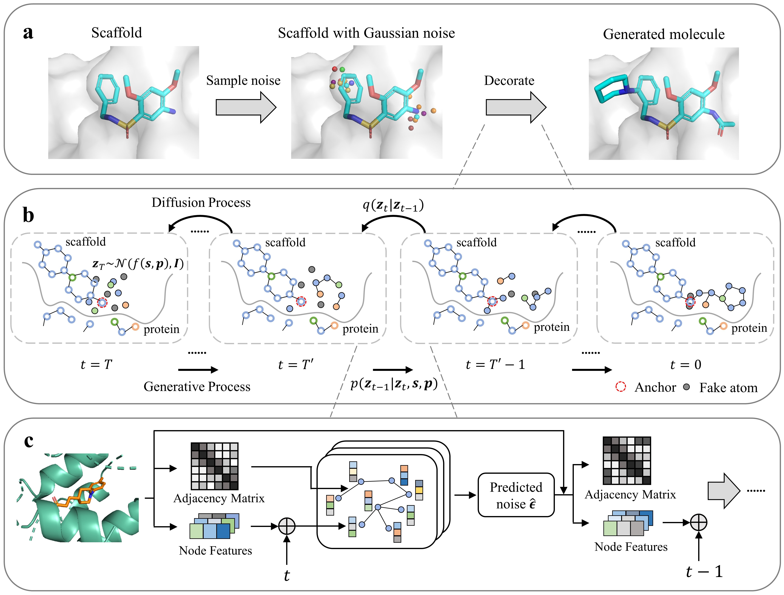

# DiffDec: Structure-Aware Scaffold Decoration with an End-to-End Diffusion Model

## Summary
DiffDec is an end-to-end E(3)-equivariant diffusion model to optimize molecules through molecular scaffold decoration conditioned on the 3D protein pocket. 

<p align='center'>
 
</p>

## Install conda environment via conda yaml file
```bash
conda env create -f environment.yaml
```

## Datasets
Please refer to [`README.md`](./data/README.md) in the `data` folder.

## Training
To train a model for single R-group decoration task, run:
```bash
python train_single.py --config configs/single.yml
```
To train a model for multi R-groups decoration task, run:
```bash
python train_multi.py --config configs/multi.yml
```

## Sampling
You can sample 100 decorated compounds for each input scaffold and protein pocket and change the corresponding parameters in the script. You can also download the model checkpoint file from [this link](https://zenodo.org/records/10527451) and save it into `ckpt/`. Run the following:
```bash
bash sample.sh
```
You will get .xyz and .sdf files of the decorated compounds in the directory `sample_mols`. 

## Evaluation
You can run evaluation scripts after sampling decorated molecules:
```bash
bash evaluate.sh
```

## Sampling for a specific protein pocket and a specific scaffold
To generate R-groups for your own pocket and scaffold, you need to provide the pdb structure file of the protein pocket, the sdf file of the scaffold, and the scaffold's smiles with anchor(s).
For Example:
```bash
CUDA_VISIBLE_DEVICES=0 python sample_single_for_specific_context.py --scaffold_smiles_file ./data/examples/scaf.smi --protein_file ./data/examples/protein.pdb --scaffold_file ./data/examples/scaf.sdf --task_name exp --data_dir ./data/examples --checkpoint ./ckpt/diffdec_single.ckpt --samples_dir samples_exp --n_samples 1 --device cuda:0
```